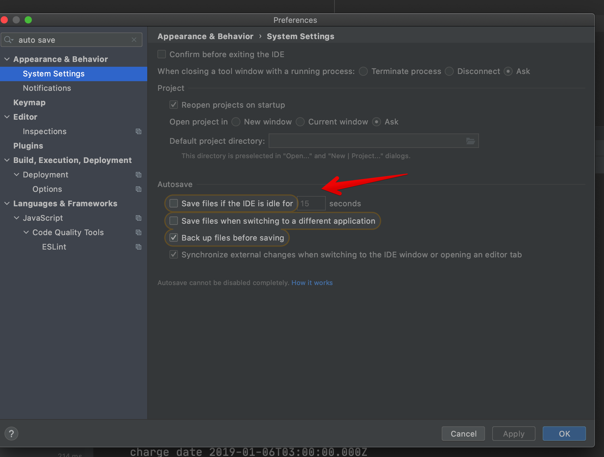
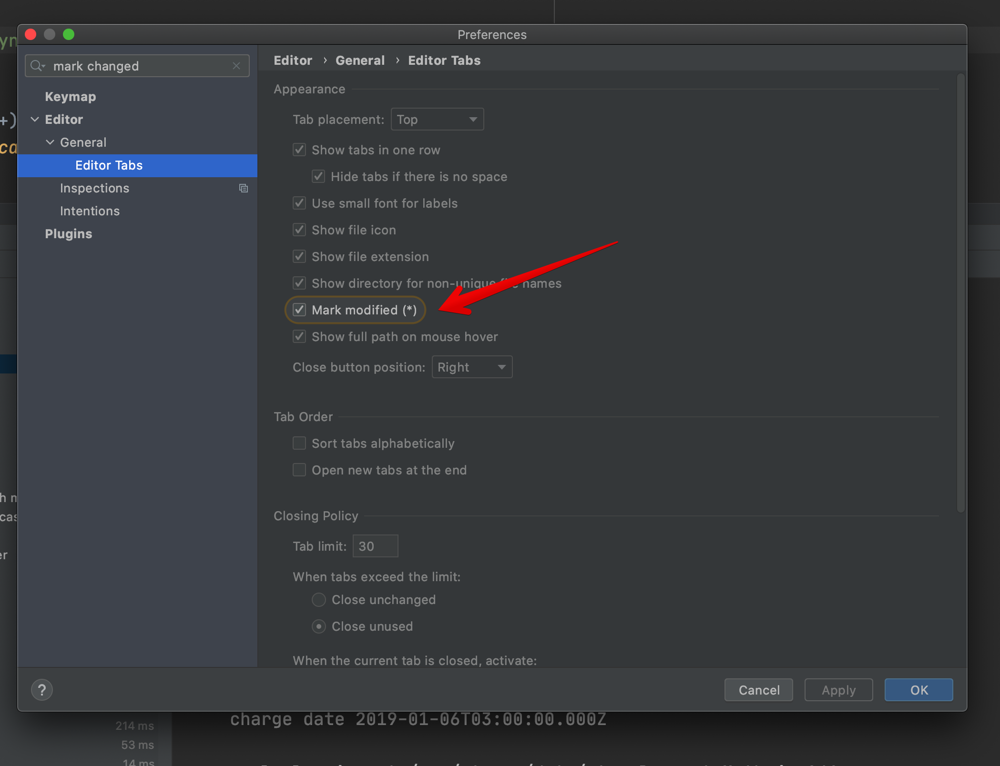

# LEARN

We are always learning here on Quave. We love to code and we also love to learn!

## Getting started

### Required Knowledge

#### Javascript Basics
- You don't know JS by [@getify](https://twitter.com/getify) - read the 6 books for free on [GitHub](https://github.com/getify/You-Dont-Know-JS/blob/1st-ed/README.md)
- JavaScript VM internals, EventLoop, Async and ScopeChains - Arindam Paul on [YouTube](https://www.youtube.com/watch?v=QyUFheng6J0)
- Event Loop - Jake Archibald on [YouTube](https://www.youtube.com/watch?v=cCOL7MC4Pl0)
- What the heck is the event loop anyway? - Philip Roberts on [YouTube](https://www.youtube.com/watch?v=8aGhZQkoFbQ)
- Everything You Need to Know About Node.js Event Loop - Bert Belder on [YouTube](https://www.youtube.com/watch?v=PNa9OMajw9w)
- The Node.js Event Loop: Not So Single Threaded - Bryan Hughes on [YouTube](https://www.youtube.com/watch?v=zphcsoSJMvM)
- Node's Event Loop From the Inside Out - Sam Roberts on [YouTube](https://www.youtube.com/watch?v=P9csgxBgaZ8)
- Broken Promises - James M Snell on [YouTube](https://www.youtube.com/watch?v=XV-u_Ow47s0)
- How To Create An App [Youtube](https://www.youtube.com/c/HowToCreateAnAppDev)
- Como Criar Um App [Youtube - Português](https://www.youtube.com/channel/UCZo_DmCzwmxMtv5Kv_dukpA)

#### Shell basics
- zsh

#### Git basics
- use ssh authentication
    - ssh-keygen > enter > enter > enter
    - cat ~/.ssh/id_rsa.pub
    - copy this text
    - paste on GitHub > Settings > SSH Keys > Choose a title and paste the key. Save
    - now you should be able to clone repositories and execute git commands using git@... instead of https:// in the remote repo.

#### IDE
- Use WebStorm (VSCode is amazing but not for production apps, a [few reasons](https://medium.com/@filipenevola/vscode-missing-features-837a6bd660ca))
    - Disable auto-save on WebStorm so you are not going to rebuild your app all the time
      
      
    - You are going to have * in your file when it is changed but not saved yet.

#### Web Security basics
- Watch this [course](https://egghead.io/lessons/express-course-overview-web-security-essentials) by [@mikesherov](https://twitter.com/mikesherov)

#### CSS
- Flexbox
    - Watch this [course](https://flexbox.io/) by [@wesbos](https://twitter.com/wesbos)
    - Read this [guide](https://css-tricks.com/snippets/css/a-guide-to-flexbox/)

#### Meteor
- Basics
    - DDP: Meteor data protocol behind Publications and Methods, we don't use it heavily on all projects but you should understand it. Read the [blog post](https://blog.meteor.com/introducing-ddp-6b40c6aff27d) and the [doc](https://github.com/meteor/meteor/blob/devel/packages/ddp/DDP.md)
    - Mobile (HCP): Understand how Meteor updates the code without publishing a new version to the store. Read [here](https://guide.meteor.com/hot-code-push.html)
